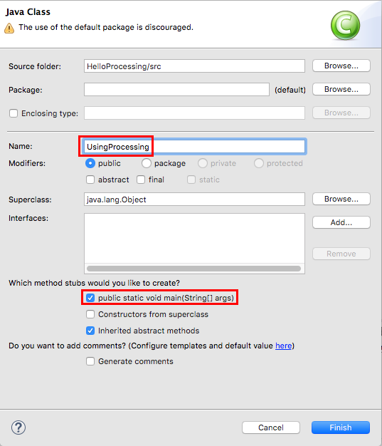
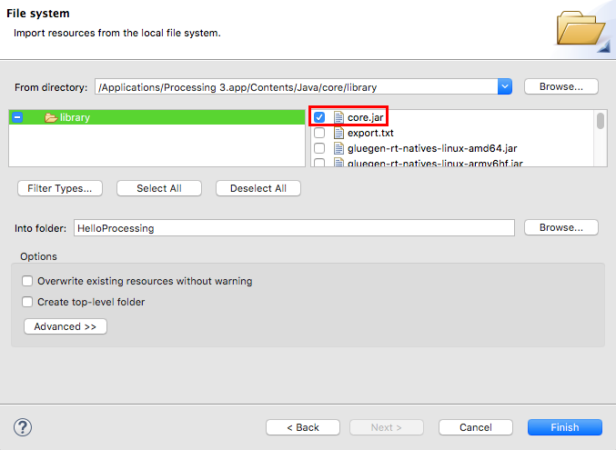
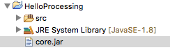
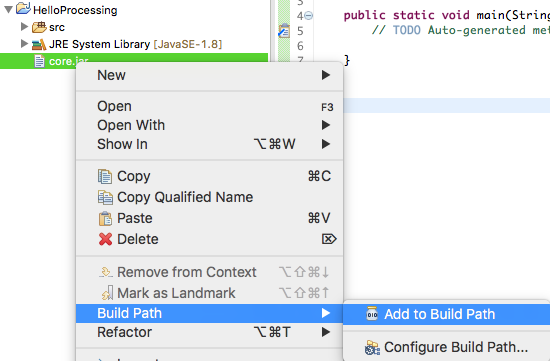
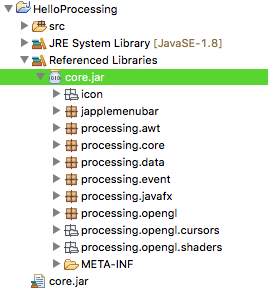
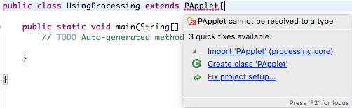
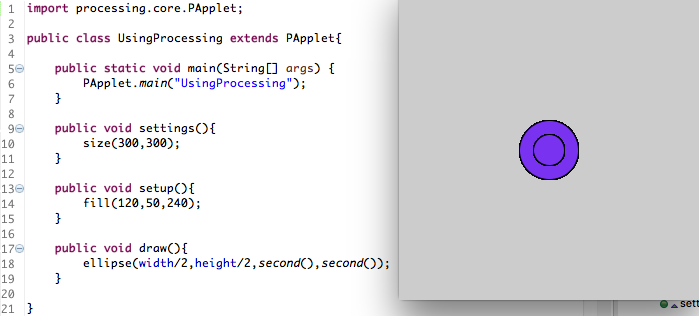
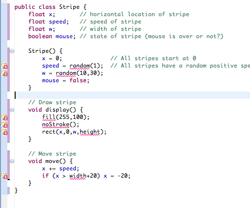

# Processing in Eclipse

> This tutorial is for Processing version 3.0+. If you see any errors or have comments, please [let us know](https://github.com/processing/processing-docs/issues?state=open). This work is licensed under a [Creative Commons Attribution-NonCommercial-ShareAlike 4.0 International License](http://creativecommons.org/licenses/by-nc-sa/4.0/).

In order to use the Processing library to create our graphics while coding in Eclipse, we need to do a couple things. The first thing we need to do is import the Processing core as a library for our project, and the second is to set up our client class to take into consideration some of the processes (pun intended) that the Processing IDE does for us in the background.

This guide is written for Processing 3+, with the intended audience of someone who has already downloaded [Eclipse](http://www.eclipse.org/), but may have never used it before. If you are experienced with Java and Eclipse, you can jump to the bottom for a quick summary of the steps involved.

### Create a new Project

First create a new project. It just needs to be a regular Java Project.

*File > New > Java Project*

Let's name it 'Hello Processing'. Leave all the default settings and click *Finish*.

Next, create a new class.

*File > New > Class*

Let's name it '*UsingProcessing*'. You can choose to include public static void main.



We should now have a new class that probably looks like this:

```java
public class UsingProcessing {

    public static void main(String[] args) {
        // TODO Auto-generated method stub

    }

}
```

Now that we have our project and client class ready to go, we need to get the Processing core as a library.

### The idea of Libraries

One of the most important aspects of Java (or nearly any programming environment) is the idea of a Library. A Library is a collection of code that performs related tasks. They can be one class, or many. Some Libraries are so powerful and robust that they can almost be considered a "Language" themselves. When you combine the Processing library with the Processing IDE, you end up with something that most people refer to as the Processing 'Language', but *technically*, at it's heart, it's a collection of Java code.

To make it work, the Processing IDE does a lot of stuff for us in the background 'Java' environment in order to make it really easy for us as programmers to create sketches. However, to make full use of all the Java awesomeness at our disposal, it's helpful to use a more robust IDE, which is why we are jumping into Eclipse. So let's get Eclipse to use Processing as a Library.

### Import the Processing Core

In order for Eclipse to see the code that makes up Processing, we need to import it into our project.

*File > Import > General > File System*

Click next. On Windows, click "Browse..." and select the Processing jar files inside PATH_TO_PROCESSING/core/library/. On OS X, do not use the "Browse..." button. Instead, use the "From directory:" field to manually enter the path to Processing's jar files, which is typically /Applications/Processing 3.app/Contents/Java/core/library/. At minimum, select the "core.jar" file inside the "library" folder.




A .jar file is a compiled collection of Java code. The core.jar is the core of the Processing libraries, it has all the code that does the stuff that we are used to doing in Processing, like drawing shapes. Once we have it, we can make use of all the normal Processing commands that are found on the [reference page](https://processing.org/reference/).

Click Finish. If you look at the Package Explorer, you'll notice that there is a new file in our project, called 'core.jar'.




Now that we have the file in our project, we need to tell Eclipse that this file is part of the code base that is used to build, or compile and run, this project. Do this by right clicking on the core.jar, going to *Build Path*, and then *Add to Build Path*



You'll notice the project will expand to have a new section called 'Referenced Libraries', where there is a new core.jar file. You can expand this to see a hierarchy of it's contents, if you are really interested.



We are finally ready to set up our client class (the class with our main function, where the program starts), to run the project like a Processing sketch.

### Setting up the Client Class

A Processing window is a special type of Java program called a PApplet. This is technically a Java Class, which has its own main function (or method) and does all kinds of fancy stuff that we don't need to worry about to create a new window and draw graphics onto it. In order for us to make use of the PApplet class, we want our program to BE a PApplet. To make this happen, we use the keyword extends in our class declaration. This will allow our class to 'inherit' all the PApplet class' functions and variables. Change the first line of code to be:

```java
public class UsingProcessing extends PApplet{
```

You'll notice this will give you an error. This occurs because, although we have included the core.jar to our project, we still have to link to the library in the code. We do this by using an import statement, at the top of the Java file. Anytime we are going to reference a function, variable, or class outside of the Java file we are writing in, we need to tell Java where it is by *importing* it. Eclipse will help you by suggesting to do this. Hover over the error (where it's underlined in red) and choose from the options "Import 'PApplet' (processing.core)".



This will auto add a new line of code to the top of the file: `import processing.core.PApplet;` You can also type this in yourself if you choose. This will allow Java to see all the public parts of the PApplet class.

The next step is to simply start a PApplet application, and tell it to use *this* class,`UsingProcessing`, as the program to run. This is done by calling PApplet's main method and giving it the name of this class as a parameter.

Add the following line to the main function (method), and if the TODO comment is still there, you can delete/replace it.

```java
PApplet.main("UsingProcessing");
```

Your entire Java file should now look like:

```java
import processing.core.PApplet;

public class UsingProcessing extends PApplet{

    public static void main(String[] args) {
        PApplet.main("UsingProcessing");

    }

}
```

*NOTE*: If your class is part of a package other than the default package, you must call PApplet's main using the package name as well, like this:

```java
PApplet.main("packageName.ClassName");
```

At this point, you can run the program. If Eclipse asks, choose to run the program as a Java Application. Processing no longer extends the Applet class, so you can't run it as an Applet!

This will run a PApplet as if you had run an empty sketch. You will get a new 100x100 window open with a blank canvas!

Now we are ready to add the final touches to be ready to program like we were before. After main(), add three new functions: `settings()`, `setup()`, and `draw()`. It's just like we did in Processing, but you will also need to include the `public` declaration before the `void` declaration. Now we have this:

```java
import processing.core.PApplet;

public class UsingProcessing extends PApplet{

    public static void main(String[] args) {
        PApplet.main("UsingProcessing");
    }

    public void settings(){

    }

    public void setup(){

    }

    public void draw(){

    }

}
```

`setup()` and `draw()` should look familiar, and they work exactly the same way as they did in the Processing IDE. The only new concession we have to make is that when we use the `size()`function to set the size of the screen, we put that in `settings()`, and we put it first. `settings()`runs before anything else happens, so we can't use any other Processing functions in it, except to set the size of the screen. More information [here](https://processing.org/reference/settings_.html).

Let's try it. Set a size in `settings()`, set a color in `setup()`, and draw some stuff in `draw()`. For example:

```java
import processing.core.PApplet;

public class UsingProcessing extends PApplet{

    public static void main(String[] args) {
        PApplet.main("UsingProcessing");
    }

    public void settings(){
        size(300,300);
    }

    public void setup(){
        fill(120,50,240);
    }

    public void draw(){
        ellipse(width/2,height/2,second(),second());
    }

}
```

We did it! We have a Processing application running from Eclipse, and now we can take advantage of all the powerful tools that Eclipse has to offer. From here, you can develop your processing sketch to your heart's content.

### The Short Version

The quick break down of what we did here:

1. Create a new Java Project
2. Import the Processing core.jar from where your Processing is installed. Add it to the build path.
3. Create a new class, and extend PApplet. Import the PApplet from `processing.core.PApplet`
4. In `main()`, call `PApplet.main("YouClassName");`
5. Add a `public void settings()`, `public void setup()`, and `public void draw()`.
6. Use the `size()` call inside of `settings()`, and other than that, use `setup()` and `draw()` like normal!



### Processing in Eclipse with Multiple Classes

Take a look at this [example Processing sketch](http://learningprocessing.com/examples/chp09/example-09-10-array-interactive-objects). The example is object-oriented and contains a class called "Stripe." In Processing, all classes are treated as "inner classes," meaning they are not individual entities unto themselves, but rather are classes inside of the larger PApplet. This is why you can do anything you can do in a PApplet inside of the Stripe class. You can draw onto the window calling rect() and access the PApplet variables such as width and height. To get this example working in Eclipse, it's perfectly reasonable to just copy it in as is and include the Stripe class code below setup() and draw() inside the parent PApplet class. However, the inner class methodology can quickly become unwieldy in the case of larger applications with lots and lots of classes. 
And so we find ourselves in need of a means for creating separate Java classes in Eclipse that we can use in conjunction with a Processing-based application. 
First thing first, we can put all the code that is not the Stripe class in a Java class like with the first example.

```java
import processing.core.*;

public class MyProcessingSketch extends PApplet {
  //	An array of stripes
  Stripe[] stripes = new Stripe[50];
  
  public static void main(String[] args){
    PApplet.main("MyProcessingSketch");
  }

  public void settings(){
    size(200,200);
  }


  public void setup() {
    // Initialize all "stripes"
    for (int i = 0; i < stripes.length; i++) {
      stripes[i] = new Stripe();
    }
  }

  public void draw() {
    background(100);
    // Move and display all "stripes"
    for (int i = 0; i < stripes.length; i++) {
      stripes[i].move();
      stripes[i].display();
    }
  }
}

```

Second, we create a new class called Stripe. 

FILE --> NEW --> CLASS. Name it "Stripe." Click "finish." 

If we add the Processing code, Eclipse will give us a bunch of errors. 



The errors are all on lines where we call a Processing function (such as rect()) or reference a Processing variable (such as width). This is because a Stripe is not a PApplet and knows nothing about PApplets! We might be tempted to have Stripe extend PApplet, but this would be a fatal error. A Stripe is not a PApplet. A Stripe is a rectangular object that we want to draw 

onto a PApplet

. What PApplet do we want to draw onto? The PApplet that is MyProcessingSketch. Instead of extending PApplet, we simply want to tell a Stripe object about a MyProcessingSketch. 

```java
public class Stripe {
  PApplet parent; // The parent PApplet that we will render ourselves onto
```

In the constructor, we initialize the parent: 

```java
  Stripe(PApplet p) {
    parent = p;
```

And then anytime we want to call a Processing function, we access it via the parent variable. 

```java
  // Draw stripe
  void display() {
    parent.fill(255,100);
    parent.noStroke();
    parent.rect(x,0,w,parent.height);
  }
```

Here's the whole thing together: 

```java
import processing.core.PApplet;

public class Stripe {
  float x;       // horizontal location of stripe
  float speed;   // speed of stripe
  float w;       // width of stripe
  boolean mouse; // state of stripe (mouse is over or not?)
  PApplet parent; // The parent PApplet that we will render ourselves onto

  Stripe(PApplet p) {
    parent = p;
    x = 0;              // All stripes start at 0
    speed = parent.random(1);  // All stripes have a random positive speed
    w = parent.random(10,30);
    mouse = false;
  }

  // Draw stripe
  void display() {
    parent.fill(255,100);
    parent.noStroke();
    parent.rect(x,0,w,parent.height);
  }

  // Move stripe
  void move() {
    x += speed;
    if (x > parent.width+20) x = -20;
  }
}
```

Finally, the last change we have to make is how we call the constructor. Previously, we had: 

```java
  stripes[i] = new Stripe();
```

But now when we construct a Stripe object, we must pass in a reference to a PApplet. And here, the PApplet is this a reference to ourselves, the PApplet we are right now, MyProcessingSketch. 

```java
  stripes[i] = new Stripe(this);
```

Here is 

the project source on GitHub

. 

Another important note. The Processing "color" primitive does not exist in Java. In fact, in Processing a "color" is really just an integer (32 bits with red, green, blue, and alpha components). Processing translates "color" to "int", but Eclipse won't do that for you. So instead of saying: 

```java
color pink = color(255,200,200);
```

you should say: 

```java
int pink = color(255,200,200);
```

and if you are in another class and have to refer to the "parent" PApplet: 

```java
int pink = parent.color(255,200,200);
```