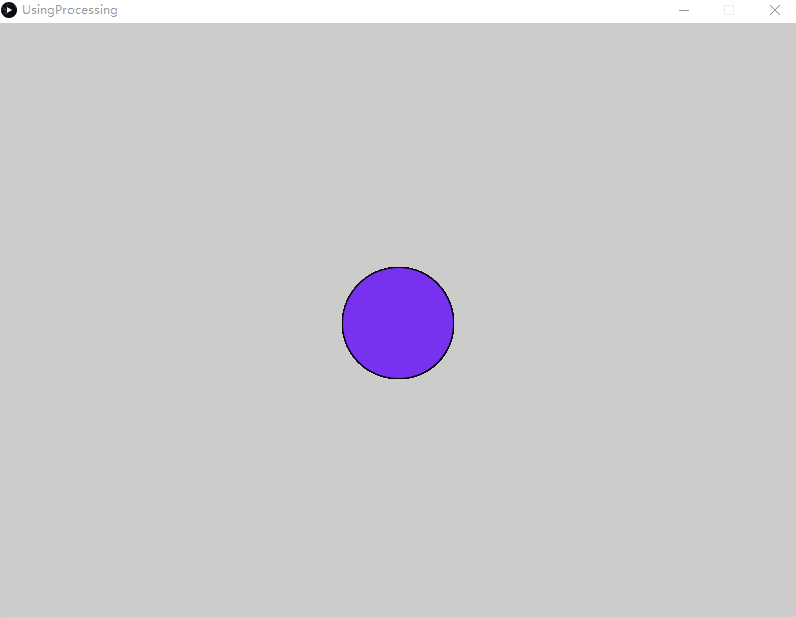

Processig 在 Eclipse里的教学环境
===================================

### 软件环境
> [Eclipse] eclipse-java-oxygen-2-win32
>
> [Processing] 3.3.4

### 目录说明
> [Soft] IDE软件环境
>
> [Sites] 媒体素材
>
> [Books] 文档集合

##案例集合

> 01 [ProcessingEclipseHelloworld] Hello World项目

### 图片资料：

