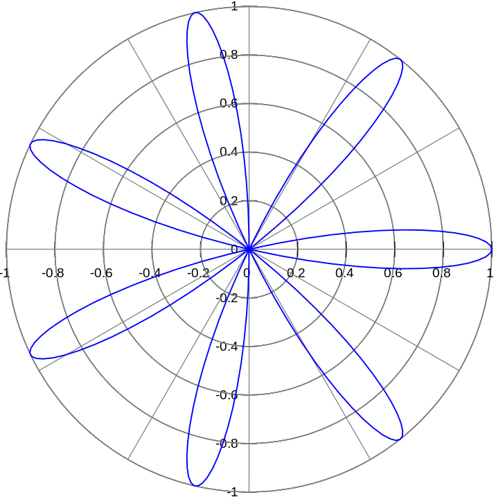
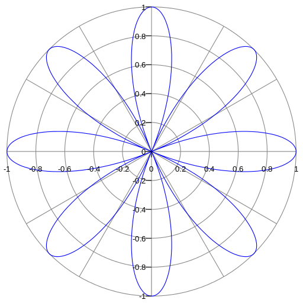
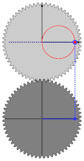
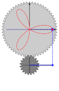

# Rose (mathematics)

[TOC]

## General overview

Up to [similarity](https://en.wikipedia.org/wiki/Similarity_(geometry)), these curves can all be expressed by a polar equation of the form
$$
\!\,r=\cos(k\theta)
$$

or, alternatively, as a pair of Cartesian parametric equations of the form
$$
\!\,x=\cos(k\theta)\cos(\theta)
$$

$$
\!\,y=\cos(k\theta)\sin(\theta)
$$

If *k* is an integer, the curve will be rose-shaped with

- 2*k* petals if *k* is even, and
- *k* petals if *k* is odd.

Where *k* is even, the entire graph of the rose will be traced out exactly once when the value of theta,θ changes from 0 to 2π. When *k* is odd, this will happen on the interval between 0 and π. (More generally, this will happen on any interval of length 2π for *k* even, and π for *k* odd.)

If *k* is a half-integer (*e.g.* 1/2, 3/2, 5/2), the curve will be rose-shaped with 4*k* petals. Example: n=7, d=2, *k*= n/d =3.5, as θ changes from 0 to 4π.

If *k* can be expressed as *n*±1/6, where *n* is a nonzero integer, the curve will be rose-shaped with 12*k* petals.

If *k* can be expressed as *n*/3, where *n* is an integer not divisible by 3, the curve will be rose-shaped with *n* petals if *n* is odd and 2*n* petals if *n* is even.

If *k* is [rational](https://en.wikipedia.org/wiki/Rational_number), then the curve is [closed](https://en.wikipedia.org/wiki/Closed_(mathematics)) and has finite length. If *k* is [irrational](https://en.wikipedia.org/wiki/Irrational_number), then it is not closed and has infinite length. Furthermore, the graph of the rose in this case forms a [dense set](https://en.wikipedia.org/wiki/Dense_set) (i.e., it comes arbitrarily close to every point in the unit disk).

Since
$$
\sin(k \theta) = \cos\left( k \theta - \frac{\pi}{2} \right) = \cos\left( k \left( \theta-\frac{\pi}{2k} \right) \right)
$$

for all $\theta$, the curves given by the polar equations

$\,r=\sin(k\theta)$ and  $\,r = \cos(k\theta)$

are identical except for a rotation of π/2*k* radians.

Rhodonea curves were named by the Italian mathematician [Guido Grandi](https://en.wikipedia.org/wiki/Guido_Grandi) between the year 1723 and 1728.[[2\]](https://en.wikipedia.org/wiki/Rose_(mathematics)#cite_note-2)

Rose with 7 petals (*k* = 7)

Rose with 8 petals (*k*=4)

Rose curves defined by $ r=a \cos (k\theta)\, $, for various values of $k= \frac n d$.

## Area

A rose whose polar equation is of the form

$$
r=a \cos (k\theta)\,
$$

where *k* is a positive integer, has [area](https://en.wikipedia.org/wiki/Polar_coordinates#Integral_calculus)
$$
\frac{1}{2}\int_{0}^{2\pi}(a\cos (k\theta))^2\,d\theta = \frac {a^2}{2} \left(\pi + \frac{\sin(4k\pi)}{4k}\right) = \frac{\pi a^2}{2}
$$
if *k* is even, and
$$
\frac{1}{2}\int_{0}^{\pi}(a\cos (k\theta))^2\,d\theta = \frac {a^2}{2} \left(\frac{\pi}{2} + \frac{\sin(2k\pi)}{4k}\right) = \frac{\pi a^2}{4}
$$
if *k* is odd.

The same applies to roses with polar equations of the form
$$
r=a \sin (k\theta)\,
$$
since the graphs of these are just rigid rotations of the roses defined using the cosine.

## How the parameter *k* affects shapes

In the form *k* = *n*, for integer n, the shape will appear similar to a flower. If *n* is odd half of these will overlap, forming a flower with *n* petals. However, if it is even the petals will not overlap, forming a flower with 2*n* petals.

When *d* is a prime number then *n*/*d* is a least common form and the petals will stretch around to overlap other petals. The number of petals each one overlaps is equal to the how far through the sequence of primes this prime is +1, i.e. 2 is 2, 3 is 3, 5 is 4, 7 is 5, etc.

In the form *k* = 1/*d* when *d* is even then it will appear as a series of *d*/2 loops that meet at 2 small loops at the center touching (0, 0) from the vertical and is symmetrical about the *x*-axis. If *d* is odd then it will have *d* div 2 loops that meet at a small loop at the center from ether the left (when in the form *d* = 4*n* − 1) or the right (*d* = 4*n* + 1).

If *d* is not prime and n is not 1, then it will appear as a series of interlocking loops.

If *k* is an irrational number (e.g.  $ \pi  $ , $ \sqrt{2} $ , etc.) then the curve will have infinitely many petals, and it will be [dense](https://en.wikipedia.org/wiki/Dense_set) in the unit disc.

|  |  |  |  |
| :----------------------------------------------------------: | :----------------------------------------------------------: | :----------------------------------------------------------: | :----------------------------------------------------------: |
|                     *n*=1, *d*=1, *k*=1                      |                   *n*=1, *d*=3, *k*≈0.333                    |                     *n*=3, *d*=1, *k*=3                      |                    *n*=4, *d*=5, *k*=0.8                     |

**Examples of roses created using gears with different ratios**

## Offset parameter

Adding an offset parameter *c*, so the polar equation becomes
$$
\!\,r=\cos(k\theta) + c
$$
alters the shape as illustrated at right. In the case where the parameter *k* is an odd integer, the two overlapping halves of the curve separate as the offset changes from zero.